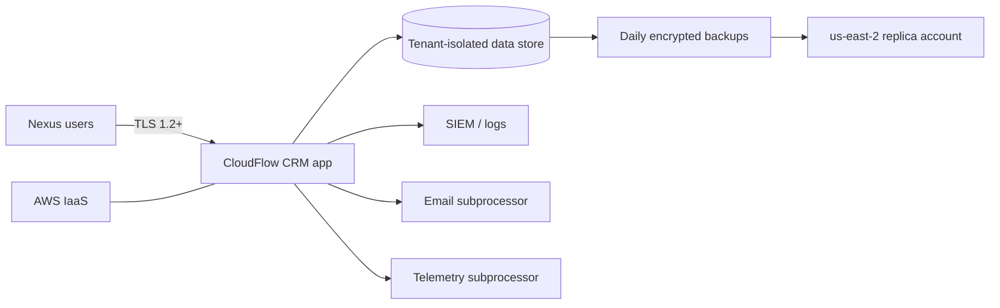

# Vendor Data Flow

**This is a fictional cybersecurity case study created for educational and portfolio purposes.**

## Narrative flow

1. A Nexus employee authenticates to CloudFlow CRM (SSO planned; MFA required as a Nexus complementary control).  
2. The user creates or updates contacts, opportunities, and support notes. Those records are Confidential.  
3. The application writes to a multi-tenant data store (tenant_id isolation) encrypted with AWS KMS.  
4. TLS 1.2+ protects traffic from the user to the application and between services (mTLS).  
5. Logs of authentication and tenant-admin actions stream to a central SIEM (12-month hot retention for key logs).  
6. Daily snapshots replicate to a separate AWS account in us-east-2.  
7. Transactional email may be sent via a subprocessor (Northmail Delivery, fictional).  
8. Product telemetry may go to PulseAnalytics Cloud (fictional) without payment data.  
9. CloudFlow operators access production support paths via MFA and a jump host, except disclosed legacy utilities (VR-008).

## Data classes in flow

| Class | Flows through CRM? | Notes |
| --- | --- | --- |
| Contact and sales Confidential data | Yes | In scope |
| Support notes | Yes | In scope |
| Payment cards / bank credentials | No | Explicitly out of product scope |
| Nexus authentication secrets for other systems | No | Must not be stored in CRM notes |

## Fourth-party implication

Any Confidential data that email or telemetry subprocessors can access inherits CloudFlow’s incomplete scored-assessment process (VR-001).
