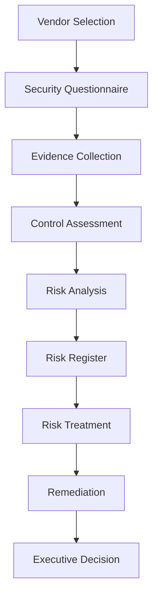

# Third-Party Vendor Risk Assessment — CloudFlow Technologies

**A Simulated SaaS Vendor Cybersecurity Risk Assessment and GRC Case Study**

**This is a fictional cybersecurity case study created for educational and portfolio purposes.** It is not an assessment of a real company, not a penetration test, not an ISO/IEC 27001 or SOC 2 audit, and not a legal or compliance opinion.

| Field | Value |
| --- | --- |
| Customer (fictional) | Nexus Financial Services |
| Vendor (fictional) | CloudFlow Technologies |
| Product | CloudFlow CRM |
| Assessment type | Initial Third-Party Vendor Security Assessment |
| Assessment ID | NEX-TPRM-2026-014 |
| Window | 3–28 February 2026 |
| Report date | 6 March 2026 |
| Overall vendor score | **74.4** |
| Overall residual risk | **High** |
| Recommendation | **Conditional Approval** |

---

## Project background

Nexus Financial Services is evaluating CloudFlow Technologies as a SaaS CRM provider. CloudFlow would process Confidential customer and employee contact information, support records, and sales data. It would not process payment cards, bank credentials, authentication secrets, or highly restricted financial records.

This repository is a complete simulated Third-Party Risk Management (TPRM) package: questionnaire, fictional evidence, control assessment, 5×5 risk scoring, risk register, treatment, remediation, scorecard, executive reporting, and validation scripts.

## Business question

> Should Nexus Financial Services onboard CloudFlow Technologies, and under what conditions?

**Answer in this case study:** Yes, with **Conditional Approval**. CloudFlow may be onboarded only with documented security conditions, including remediation of High residual findings, contractual security requirements, and annual reassessment.

## Objectives

1. Define the vendor relationship and assessment scope.  
2. Collect and review a security questionnaire and evidence.  
3. Assess controls against NIST CSF, NIST SP 800-161 concepts, ISO/IEC 27001 concepts, SOC 2 TSC concepts, and CIS Control concepts **as references, not certifications**.  
4. Identify gaps, score inherent and residual risk, and record treatment.  
5. Produce a scorecard, executive decision pack, and a reproducible portfolio case study.

## Frameworks used (methodological guidance only)

The assessment methodology combines concepts from recognized cybersecurity governance and supply-chain risk management frameworks. **This simulated assessment does not constitute an ISO 27001 audit, SOC 2 audit, certification assessment, penetration test, or legal compliance opinion.**

## Repository structure

```text
third-party-vendor-risk-assessment/
├── 00_Project_Overview/     Charter, scenario, scope, methodology, timeline
├── 01_Vendor_Profile/       Vendor, data flow, architecture, criticality
├── 02_Security_Questionnaire/
├── 03_Vendor_Evidence/     Fictional policies and summaries (PDF)
├── 04_Control_Assessment/
├── 05_Risk_Assessment/     5×5 model, inherent/residual
├── 06_Risk_Register/
├── 07_Remediation/
├── 08_Risk_Treatment/
├── 09_Vendor_Scorecard/
├── 10_Executive_Report/
├── 11_Final_Report/
├── 12_Presentation/
├── 13_Portfolio/            CV, LinkedIn, interview points
├── 14_Scripts/              Scoring, charts, validation
└── 15_Final_Checks/         QA and traceability
```

## Assessment process



## Risk methodology

Likelihood (1–5) × Impact (1–5). Ratings: 1–4 Low, 5–9 Moderate, 10–16 High, 17–25 Critical. Existing controls reduce residual likelihood or impact **only when they demonstrably change exposure**. A 74.4 score does **not** mean Low risk.

## Key findings (primary High residual)

| ID | Title | Inherent | Residual | Treatment |
| --- | --- | ---: | ---: | --- |
| VR-001 | Weak Subprocessor Governance | 16 High | 12 High | Mitigate |
| VR-002 | Insufficient Backup Recovery Testing | 16 High | 12 High | Mitigate |
| VR-003 | Undefined Recovery Point Objective | 16 High | 12 High | Mitigate |
| VR-004 | Unclear Incident Notification SLA | 16 High | 12 High | Mitigate |
| VR-005 | SOC 2 Type I Only | 9 Moderate | 6 Moderate | Accept with conditions |
| VR-006 | No ISO 27001 Certification | 9 Moderate | 6 Moderate | Accept with conditions |
| VR-007 | Vulnerability Remediation Window | 12 High | 9 Moderate | Accept with conditions |
| VR-008 | Legacy MFA Gap | 16 High | 9 Moderate | Mitigate |

## Setup

```bash
mkdir third-party-vendor-risk-assessment
cd third-party-vendor-risk-assessment
git init
python3 -m venv .venv
```

macOS/Linux: `source .venv/bin/activate`  
Windows: `.venv\Scripts\activate`

```bash
pip install -r requirements.txt
python 14_Scripts/calculate_risk_scores.py
python 14_Scripts/generate_scorecard.py
python 14_Scripts/validate_project.py
```

## Git

Commit project documents, Excel workbooks, PDFs, and scripts. Do **not** commit `.venv/`, `__pycache__/`, editor folders, or secrets. There are no live credentials in this repository; all organizations and evidence are fictional.

```bash
git add .
git commit -m "Initial third-party vendor risk assessment project"
```

## Limitations

This project is fictional, simulated, and educational. It is not a real vendor assessment, penetration test, vulnerability assessment, ISO audit, SOC audit, legal opinion, or certification.

## How to present this in a portfolio

State clearly that you **built a simulated TPRM case study**. Walk interviewers from questionnaire → evidence → residual risk → Conditional Approval. Show the traceability matrix and the validation script. Do not imply Nexus or CloudFlow are real assessed entities.

## License

MIT License. See `LICENSE`.
